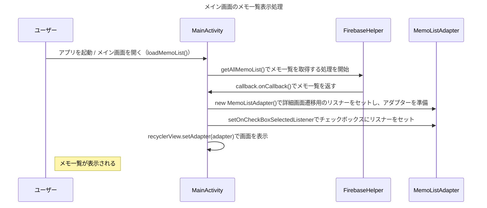
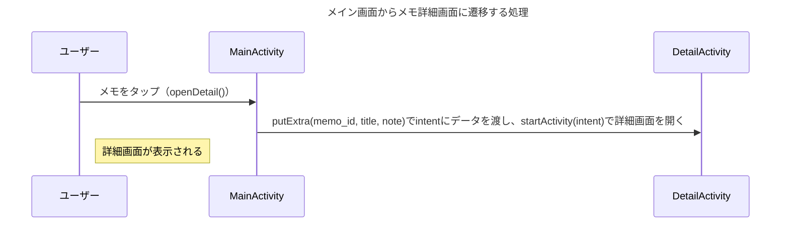
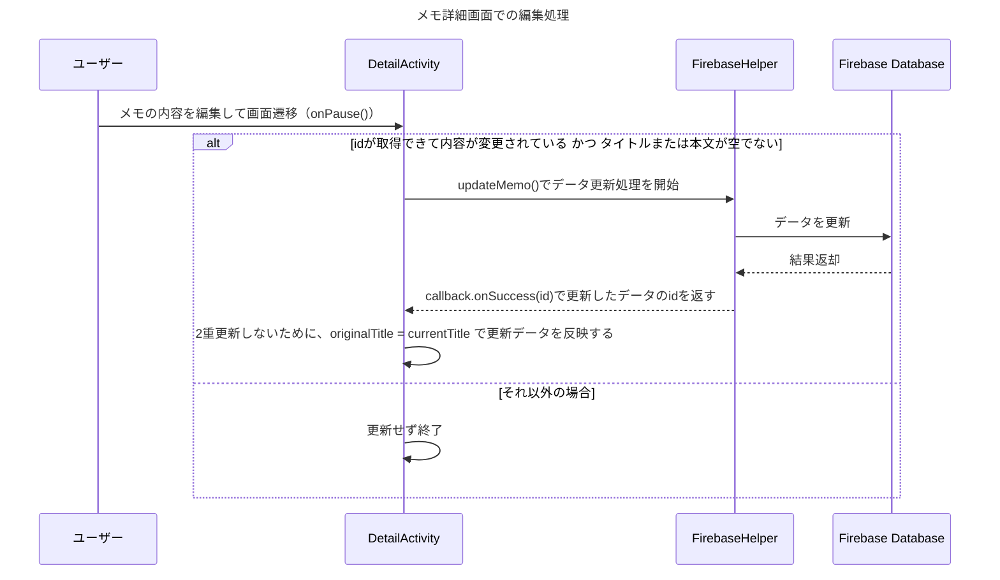
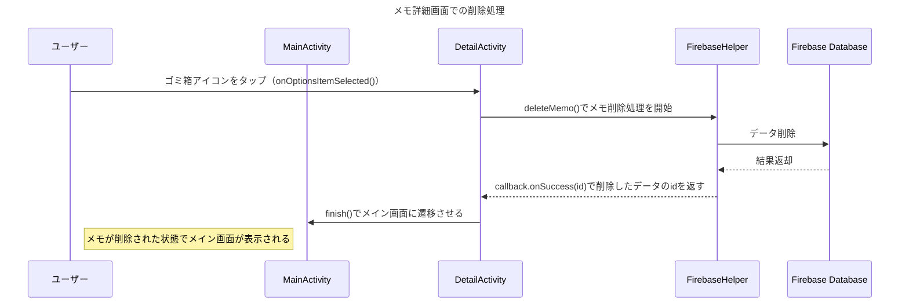
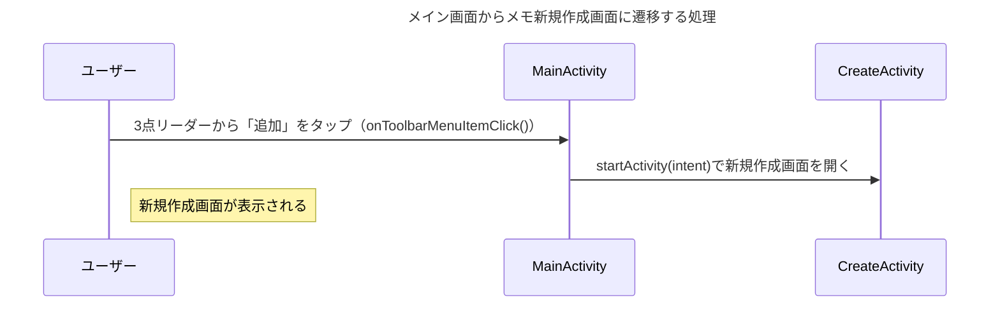
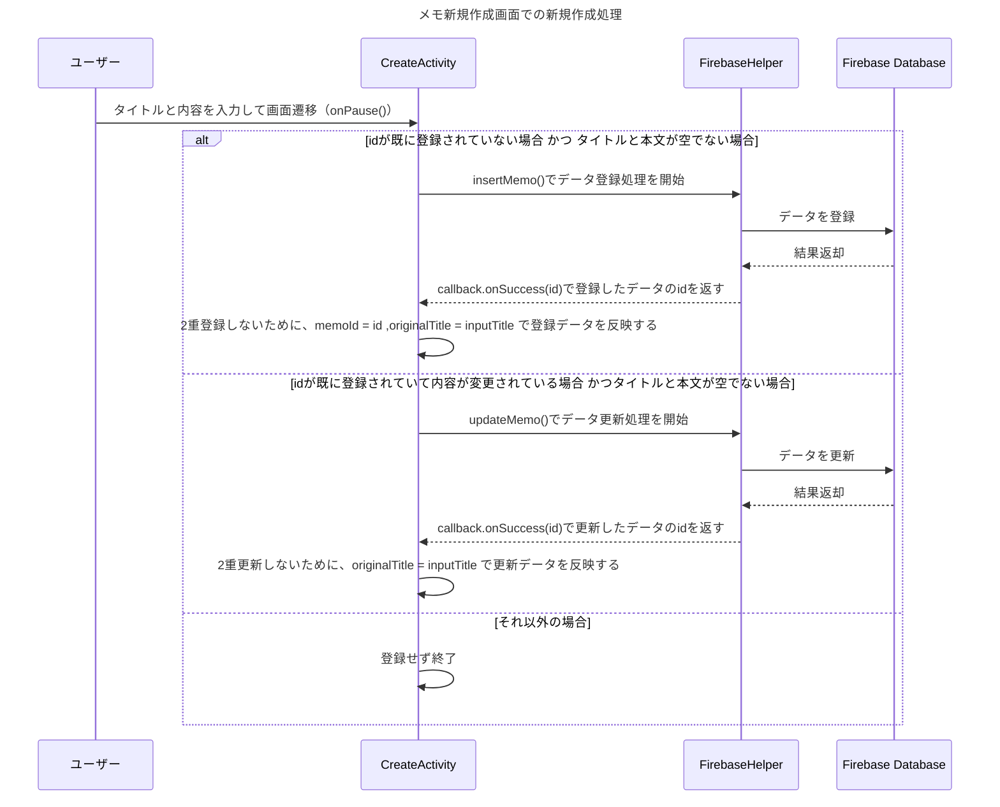
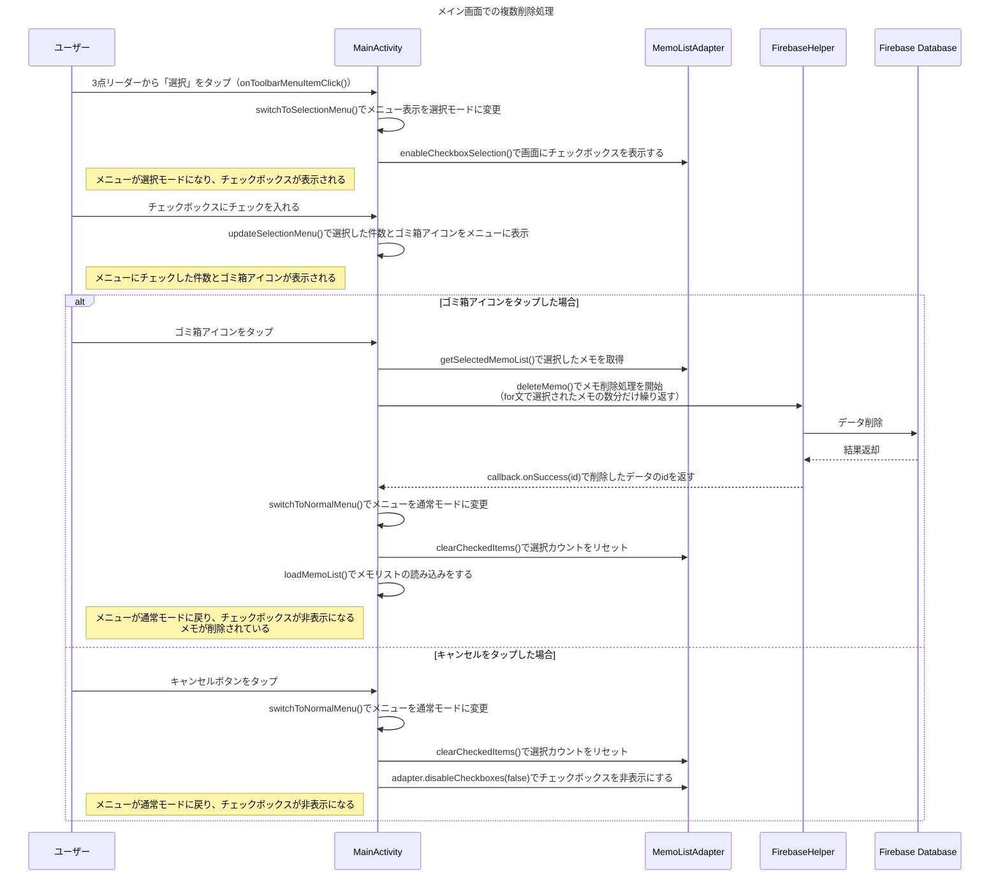

```mermaid
sequenceDiagram
    title メイン画面のメモ一覧表示処理
    
    participant User as ユーザー
    participant Main as MainActivity
    participant Firebase as FirebaseHelper
    participant Adapter as MemoListAdapter

    User ->> Main: アプリを起動 / メイン画面を開く（loadMemoList()）
    Main->>Firebase: getAllMemoList()でメモ一覧を取得する処理を開始

    Firebase->>Main: callback.onCallback()でメモ一覧を返す
    Main->>Adapter: new MemoListAdapter()で詳細画面遷移用のリスナーをセットし、アダプターを準備
    Main->>Adapter: setOnCheckBoxSelectedListenerでチェックボックスにリスナーをセット
    Main->>Main: recyclerView.setAdapter(adapter)で画面を表示
    note right of User: メモ一覧が表示される
```

```mermaid
sequenceDiagram
    title メイン画面からメモ詳細画面に遷移する処理
    participant User as ユーザー
    participant Main as MainActivity
    participant Detail as DetailActivity

    User->>Main: メモをタップ（openDetail()）
    Main->>Detail: putExtra(memo_id, title, note)でintentにデータを渡し、startActivity(intent)で詳細画面を開く
    note right of User: 詳細画面が表示される
```

```mermaid
sequenceDiagram
    title メモ詳細画面での編集処理
    participant User as ユーザー
    participant Detail as DetailActivity
    participant Firebase as FirebaseHelper
    participant DB as Firebase Database

    User->>Detail: メモの内容を編集して画面遷移（onPause()）
    alt idが取得できて内容が変更されている かつ タイトルまたは本文が空でない
        Detail->>Firebase: updateMemo()でデータ更新処理を開始
        Firebase->>DB: データを更新
        DB-->>Firebase: 結果返却
        Firebase-->>Detail: callback.onSuccess(id)で更新したデータのidを返す
        Detail->>Detail: 2重更新しないために、originalTitle = currentTitle で更新データを反映する
    else それ以外の場合
        Detail->>Detail: 更新せず終了
    end
```

```mermaid
sequenceDiagram
    title メモ詳細画面での削除処理
    participant User as ユーザー
    participant Main as MainActivity
    participant Detail as DetailActivity
    participant Firebase as FirebaseHelper
    participant DB as Firebase Database

    User->>Detail: ゴミ箱アイコンをタップ（onOptionsItemSelected()）
    Detail->>Firebase: deleteMemo()でメモ削除処理を開始
    Firebase->>DB: データ削除
    DB-->>Firebase: 結果返却
    Firebase-->>Detail: callback.onSuccess(id)で削除したデータのidを返す
    Detail->>Main: finish()でメイン画面に遷移させる
    note right of User: メモが削除された状態でメイン画面が表示される
```

```mermaid
sequenceDiagram
    title メイン画面からメモ新規作成画面に遷移する処理
    participant User as ユーザー
    participant Main as MainActivity
    participant C as CreateActivity

    User->>Main: 3点リーダーから「追加」をタップ（onToolbarMenuItemClick()）
    Main->>C: startActivity(intent)で新規作成画面を開く
    note right of User: 新規作成画面が表示される
```

```mermaid
sequenceDiagram
    title メモ新規作成画面での新規作成処理
    participant User as ユーザー
    participant C as CreateActivity
    participant Firebase as FirebaseHelper
    participant DB as Firebase Database

    User->>C: タイトルと内容を入力して画面遷移（onPause()）
    alt idが既に登録されていない場合 かつ タイトルと本文が空でない場合
        C->>Firebase: insertMemo()でデータ登録処理を開始
        Firebase->>DB: データを登録
        DB-->>Firebase: 結果返却
        Firebase-->>C: callback.onSuccess(id)で登録したデータのidを返す
        C->>C: 2重登録しないために、memoId = id ,originalTitle = inputTitle で登録データを反映する
    else idが既に登録されていて内容が変更されている場合 かつタイトルと本文が空でない場合
        C->>Firebase: updateMemo()でデータ更新処理を開始
        Firebase->>DB: データを更新
        DB-->>Firebase: 結果返却
        Firebase-->>C: callback.onSuccess(id)で更新したデータのidを返す
        C->>C: 2重更新しないために、originalTitle = inputTitle で更新データを反映する
    else それ以外の場合
        C->>C: 登録せず終了
    end
```

```mermaid
sequenceDiagram
    title メイン画面での複数削除処理
    participant User as ユーザー
    participant Main as MainActivity
    participant Adapter as MemoListAdapter
    participant Firebase as FirebaseHelper
    participant DB as Firebase Database
    
    User->>Main: 3点リーダーから「選択」をタップ（onToolbarMenuItemClick()）
    Main->>Main: switchToSelectionMenu()でメニュー表示を選択モードに変更
    Main->>Adapter: enableCheckboxSelection()で画面にチェックボックスを表示する
    note right of User: メニューが選択モードになり、チェックボックスが表示される
    
    User->>Main: チェックボックスにチェックを入れる
    Main->>Main: updateSelectionMenu()で選択した件数とゴミ箱アイコンをメニューに表示
    note right of User: メニューにチェックした件数とゴミ箱アイコンが表示される
    
    alt ゴミ箱アイコンをタップした場合
    
    User->>Main: ゴミ箱アイコンをタップ
    Main->>Adapter: getSelectedMemoList()で選択したメモを取得
    Main->>Firebase: deleteMemo()でメモ削除処理を開始<br/>（for文で選択されたメモの数分だけ繰り返す）
    Firebase->>DB: データ削除
    DB-->>Firebase: 結果返却
    Firebase-->>Main: callback.onSuccess(id)で削除したデータのidを返す
    Main->>Main: switchToNormalMenu()でメニューを通常モードに変更
    Main->>Adapter: clearCheckedItems()で選択カウントをリセット
    Main->>Main: loadMemoList()でメモリストの読み込みをする
    
    note right of User: メニューが通常モードに戻り、チェックボックスが非表示になる<br/>メモが削除されている

    else キャンセルをタップした場合

    User->>Main: キャンセルボタンをタップ
    Main->>Main: switchToNormalMenu()でメニューを通常モードに変更
    Main->>Adapter: clearCheckedItems()で選択カウントをリセット
    Main->>Adapter: adapter.disableCheckboxes(false)でチェックボックスを非表示にする
    note right of User: メニューが通常モードに戻り、チェックボックスが非表示になる

    end
    
```
