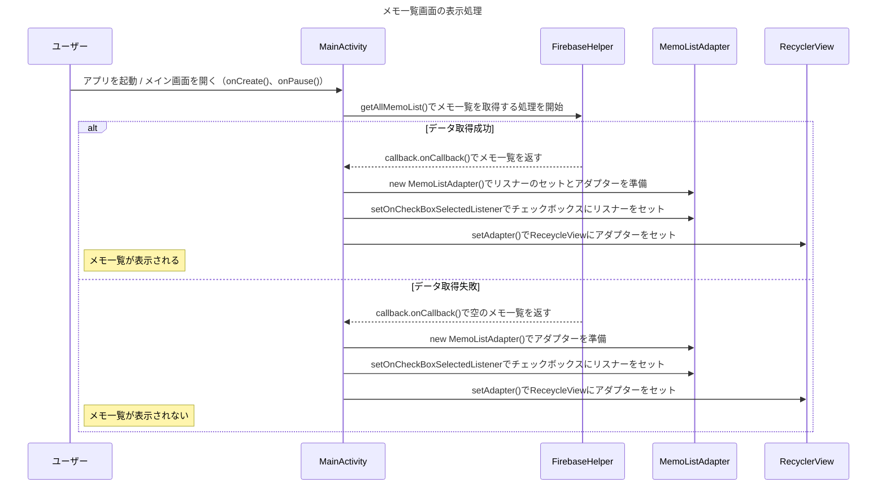

```mermaid
sequenceDiagram
    title メモ詳細画面遷移と処理の流れ

    participant User as ユーザー
    participant Main as MainActivity
    participant Intent as Intent
    participant Detail as DetailActivity
    participant Firebase as FirebaseHelper
    participant DB as Firebase Database

    %% --- 画面遷移 ---
    User->>Main: メモをタップ（openDetail()）
    Main->>Intent: putExtra(memo_id, title, note)で詳細画面にデータを渡す
    Main->>Detail: startActivity(intent)で詳細画面を開く
    Detail->>Intent: intentにアクセスしデータを取得
    note right of User: 詳細画面が表示される

    %% --- 編集して戻る時（onPause） ---
    User->>Detail: メモの内容を編集して画面遷移（onPause()）
    alt 内容が変更されている かつ タイトルまたは本文が空でない
        Detail->>Firebase: updateMemo()でデータ更新処理を開始
        Firebase->>DB: データを更新
        DB-->>Firebase: 結果返却
        Firebase-->>Detail: callback.onSuccess(id)で更新したデータのidを返す
        Detail->>Detail: 2重保存されないため、originalTitle = currentTitle で更新データを反映する
    else 内容が空 または 変更なし
        Detail->>Detail: 更新せず終了
    end

    %% --- 削除処理 ---
    User->>Detail: ゴミ箱アイコンをタップ（onOptionsItemSelected()）
    Detail->>Firebase: deleteMemo()でメモ削除処理を開始
    Firebase->>DB: データ削除
    DB-->>Firebase: 結果返却
    Firebase-->>Detail: callback.onSuccess(id)で削除したデータのidを返す
    Detail->>Main: finish()でメイン画面に遷移させる
    note right of User: メイン画面が表示される
