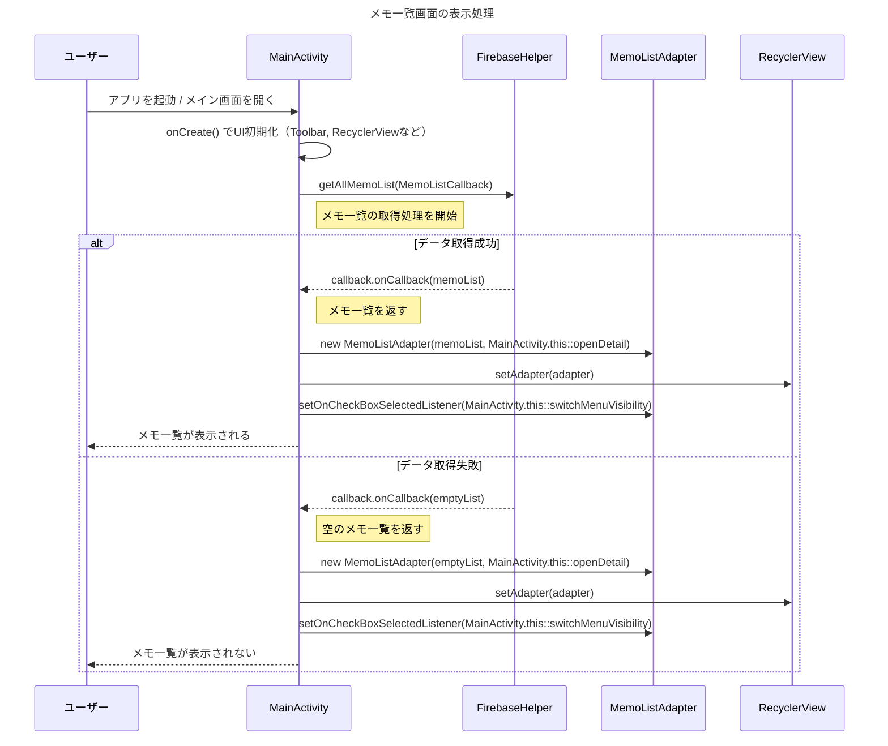

```mermaid
sequenceDiagram
    title メモ詳細画面遷移と処理の流れ

    participant User as ユーザー
    participant Main as MainActivity
    participant Intent as Intent
    participant Detail as DetailActivity
    participant Firebase as FirebaseHelper
    participant DB as Firebase Database

    %% --- 画面遷移 ---
    User->>Main: メモをタップ（openDetail(memo)）
    Main->>Intent: putExtra(memo_id, title, note)
    Main->>Detail: startActivity(intent)
    Note right of Detail: onCreate() 呼び出し<br>レイアウト・ツールバー設定<br>Intentからメモ情報取得
    Detail->>Detail: titleEditView.setText(originalTitle)<br>noteEditView.setText(originalNote)
    Main -->> User: メモ詳細画面が表示される

    %% --- 編集して戻る時（onPause） ---
    User->>Detail: メモの内容を編集
    Detail->>Detail: onPause() 呼び出し
    alt 内容が変更されている AND タイトルまたは本文が空でない
        Detail->>Firebase: updateMemo(memoId, currentTitle, currentNote, callback)
        Firebase->>DB: データ更新
        DB-->>Firebase: 更新結果返却
        Firebase-->>Detail: callback.onSuccess(id)
        Note right of Detail: originalTitle / originalNote 更新
    else 内容が空 または 変更なし
        Detail->>Detail: 更新せず終了
    end

    %% --- 削除処理 ---
    User->>Detail: ゴミ箱アイコンをタップ
    Detail->>Firebase: deleteMemo(memoId, callback)
    Firebase->>DB: データ削除
    DB-->>Firebase: 結果返却
    Firebase-->>Detail: callback.onSuccess(id)
    Detail->>Main: finish()（メイン画面に戻る）
